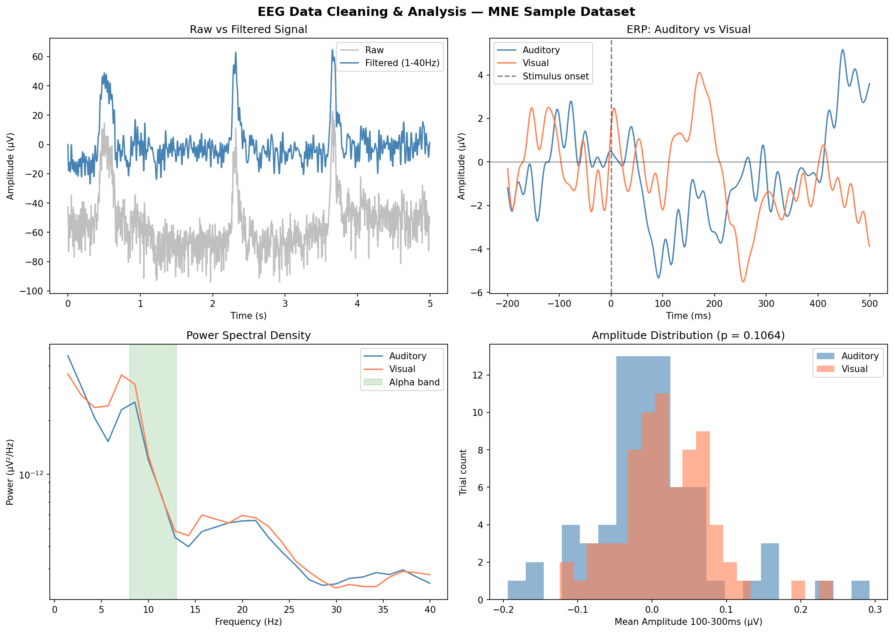

EEG DATA CLEANING & ANALYSIS
or how to go from messy brain signals to something meaningful

a python pipeline for cleaning and analyzing real EEG data using MNE's 
built-in sample dataset, an actual human brain recording from an 
auditory/visual experiment.

what this does:
  -> loads raw EEG+MEG recording and isolates only EEG channels (60 total)
  -> applies average reference and bandpass filter (1-40 Hz) to clean the signal
  -> detects and interpolates bad channels automatically
  -> cuts continuous data into epochs time-locked to stimulus events
  -> computes ERPs (Event-Related Potentials) for auditory vs visual conditions
  -> computes Power Spectral Density and compares alpha band power across conditions
  -> runs a statistical test (independent t-test) on the 100-300ms response window
  -> visualizes everything in a single figure

observations:
  -> raw signal has slow DC drift and visible eye blink spikes. 
  after bandpass filtering it centers around zero and the noise clears up.
  -> auditory ERP peaks around 95ms post stimulus. visual ERP peaks slightly 
  later, consistent with the difference in processing speed between the two modalities.
  -> visual alpha power (8-13 Hz) is higher in the auditory condition than visual, 
  reflecting visual cortex idling when no visual stimulus is present.
  -> whole-scalp t-test on the 100-300ms window came out non-significant (p = 0.106), 
  expected when averaging across all 60 channels since the two responses 
  are spatially separated on the scalp.

dataset:
MNE sample dataset, real EEG+MEG recording, publicly available.
subject heard tones (left/right ear) and saw checkerboard patterns (left/right).
320 total trials, 288 survived artifact rejection.

dependencies:
mne, numpy, matplotlib, scipy
